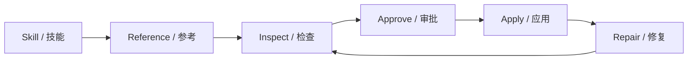

# EGS Java Agent in Unity

A Java course-design project that embeds a Java AI agent into the Unity Editor. The Unity plugin can start the local Java service, send scene-aware requests, review generated file proposals, apply approved changes, attach generated scripts, and roll back applied edits.

## Current Status

- Java backend builds successfully with JDK 21 and Gradle 8.14.3.
- Unity editor plugin has one main workspace: `Window > EGS Java Agent > Workspace`.
- UI supports Chinese and English switching in the workspace toolbar.
- Provider API keys can be stored locally in Unity EditorPrefs or read from environment variables.
- The default model route is DeepSeek + LangChain4j. Missing keys now show setup guidance instead of pretending to run.

## Quickstart

1. Build the Java backend:

```powershell
$env:JAVA_HOME = "C:\tmp\jdk21\jdk-21.0.5+11"
$env:PATH = "$env:JAVA_HOME\bin;$env:PATH"
cd C:\Users\kiiye\Desktop\EGS-JavaAgent-In-Unity\java-agent
.\gradlew.bat build --no-daemon
```

2. Install the Unity plugin:

Copy `unity-client/Assets/EGS/JavaAgent` into your Unity project at `Assets/EGS/JavaAgent`.

3. Configure the provider:

Open `Edit > Project Settings > EGS Java Agent`.

For DeepSeek:

```text
Provider: deepseek
Gateway: langchain4j
Model: deepseek-v4-flash
Required key: DEEPSEEK_API_KEY
```

Paste the key into `Local API Key` or set it in the environment.

4. Start from Unity:

Open `Window > EGS Java Agent > Workspace`, click `Start Agent`, then `Check Agent`.

5. Use the workflow:

Enter a request, choose a skill profile, optionally add reference files or URLs, click `Send`, review proposals in `Approval Queue`, then approve and apply.

## Unity Workflow

The workspace uses a six-node flow:



The nodes are not decorative only: they map to concrete plugin state such as selected skill profile, attached references, latest tool results, pending approvals, applied asset snapshots, and compiler repair attempts.

## Documentation

- [Architecture and UML](docs/architecture-and-uml.md)
- [Program Flow](docs/program-flow.md)
- [Modules and Data Structures](docs/modules-and-data.md)
- [Unity Usage Guide](docs/unity-usage.md)

## Project Layout

```text
java-agent/
  src/main/java/com/egs/javaagent/
  build/install/egs-java-agent/
unity-client/
  Assets/EGS/JavaAgent/Editor/
  Assets/EGS/JavaAgent/Runtime/
docs/
  architecture-and-uml.md
  program-flow.md
  modules-and-data.md
  unity-usage.md
```

## Notes

Do not commit API keys. Unity stores local keys in `EditorPrefs`, not project assets.
