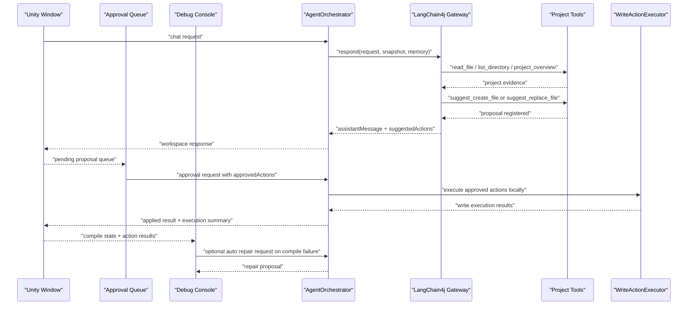

# Approval Architecture

This document describes the current approval and repair flow implemented in the Unity + Java agent product. The active runtime path is `langchain4j` only.

## Current Product Loop

1. Unity sends a normal chat request to `POST /v1/agent/execute`.
2. Java scans project context, loads memory, and asks the active gateway for an assistant response.
3. When the request looks like it needs file edits, the system returns reviewable proposals in `suggestedActions`.
4. In `langchain4j` mode, the model can now inspect files with tools and register structured proposals with:
   - `suggest_create_file`
   - `suggest_replace_file`
5. Unity routes those proposals into a dedicated `Approval Queue` window with manual review and safe-create auto-approval options.
6. When the user approves one or more proposals, Unity sends a second request with `payload.approvedActions`.
7. Java skips the model call for that approval request and executes the reviewed write locally through `WriteActionExecutor`.
8. The result comes back in `actionExecutionResults`, and the Unity session state updates the shared workflow, pending queue, and debug console.
9. After file apply, Unity refreshes assets, monitors compile diagnostics, and can automatically trigger a repair loop with concrete compiler messages.
10. If the resulting script compiles to a valid `MonoBehaviour`, Unity can automatically or manually attach it to the selected objects.

## Safety Boundary

The write path is intentionally constrained:

1. Only explicitly approved actions are executed.
2. Approval execution currently supports:
   - creating a new UTF-8 text file
   - replacing the full contents of an existing UTF-8 text file
3. Targets are resolved through `ProjectPathResolver` and must stay inside the Unity project workspace.
4. Approval execution does not re-query the model, so applying a reviewed proposal does not depend on external API availability.
5. No delete action is implemented.
6. No arbitrary shell command execution is implemented.
7. Auto-approval is limited on the Unity side to create-file proposals under `Assets/`, so it can be disabled or tightened without changing backend safety guarantees.

## Implemented Modules

### Unity side

1. `JavaAgentSessionState`
   - owns the shared workflow state, request history, approval queue, compile-driven automation, and event log
2. `JavaAgentWindow`
   - acts as the dockable workspace for authoring prompts and reading the agent transcript
3. `JavaAgentApprovalWindow`
   - provides a dedicated proposal review surface for manual approval, rejection, and bulk-safe approval
4. `JavaAgentDebugWindow`
   - surfaces compile diagnostics, tool outputs, event logs, and repair controls
2. `AgentContracts`
   - defines `AgentApprovedAction`
   - adds `approvedActions` to `AgentPayload`
3. `CompileDiagnosticsTracker`
   - raises snapshot updates that drive the auto-debug loop

### Java side

1. `AgentOrchestrator`
   - detects approval-mode requests
   - skips the model call for approved actions
   - merges read-only execution, write execution, and model tool traces
2. `WriteActionExecutor`
   - applies approved file creation and full-file replacement
3. `ProjectPathResolver`
   - resolves safe writable targets inside the Unity project
4. `LangChain4jLanguageModelGateway`
   - now supports model-driven proposal registration, not just model-driven reading

## Approval Sequence

## Review Focus

If you are reviewing this architecture, the main approval points are:

1. Whether full-file replacement is still the right first write primitive for broader Unity authoring.
2. Whether safe auto-approval should remain limited to `Assets/` create actions or gain richer policy rules later.
3. Whether the next repair iteration should add diff visualization and partial-file patch previews.
