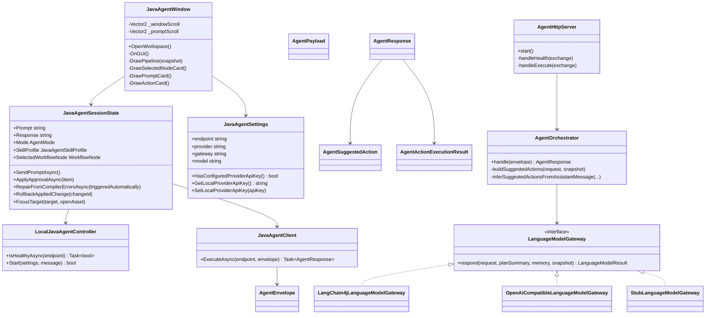

# Architecture and UML

## Main Modules

- Unity Editor Client: workspace UI, settings, approval queue, debug console, compile diagnostics, and local Java process launcher.
- Unity Runtime Contracts: JSON DTOs shared by the editor client and Java HTTP API.
- Java HTTP Server: `/health` and `/v1/agent/execute` endpoints.
- Agent Orchestrator: validates requests, scans project context, manages memory, merges suggested actions, executes approved writes, and returns diagnostics.
- LLM Gateway: `LangChain4jLanguageModelGateway`, `OpenAiCompatibleLanguageModelGateway`, or `StubLanguageModelGateway`.

## UML Class Diagram

## Key Design Choices

- The Unity plugin never writes files directly from free-form model text. It queues proposals, then applies only approved actions.
- Applied writes are snapshotted so the debug console can roll them back.
- Provider keys are not serialized into Unity assets.
- LangChain4j is the default tool-calling gateway. The HTTP gateway remains available for provider compatibility.
