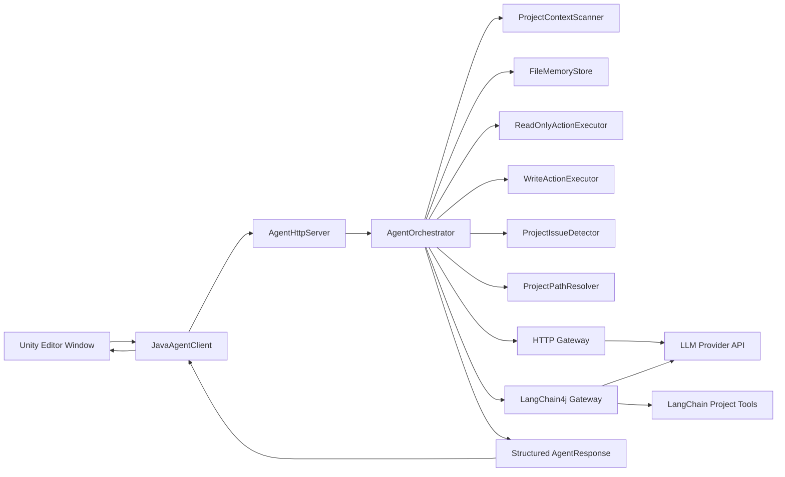
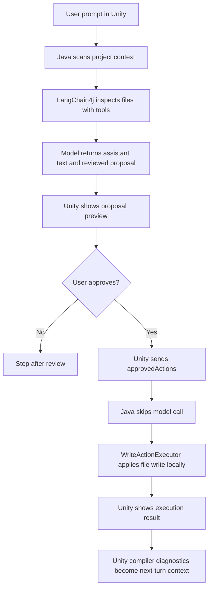
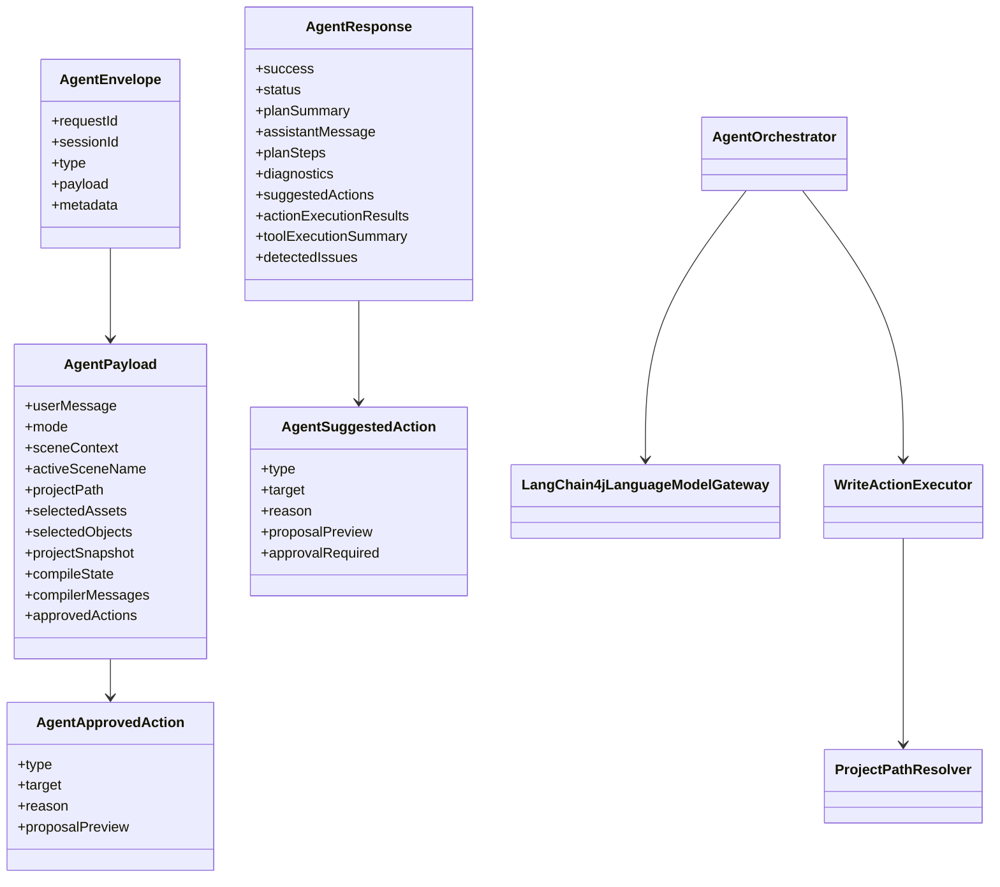

# Architecture Review Draft

This file is the current approval-facing architecture summary.

## High-Level Architecture

## Two-Phase Edit Flow

## UML

## Approval Notes

This architecture is ready for testing if you accept these current boundaries:

1. approved writes are full-file create or full-file replace
2. proposal generation is model-driven
3. proposal application is local and deterministic
4. compile errors are captured on the Unity side and returned as next-turn context
