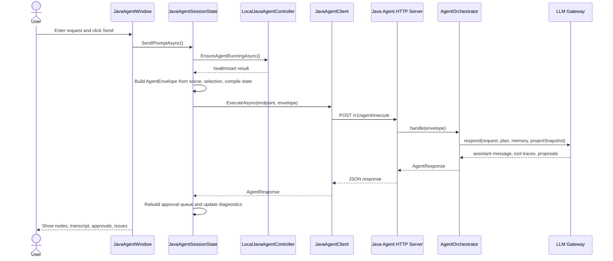
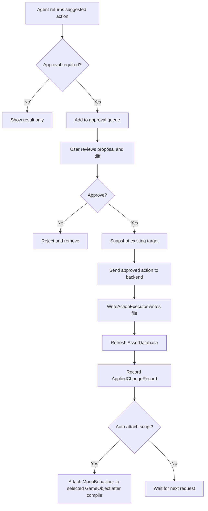
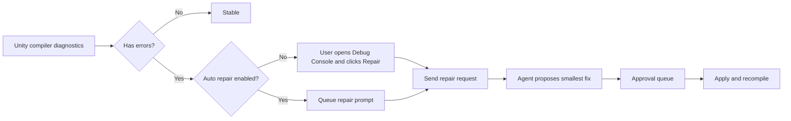

# Program Flow

## Unity Request Flow

## Approval and Apply Flow

## Compile Repair Flow

## Node Meaning

- Skill: selected built-in profile such as Shader, Material, Function, Validation, Scene, or Project.
- Reference: local files or URLs attached to the request.
- Inspect: file reads, scene selection, project scan, and compiler context.
- Approve: proposed writes waiting for human or safe auto approval.
- Apply: approved writes, snapshots, focus/open helpers, and script attach.
- Repair: compiler-error feedback loop.
